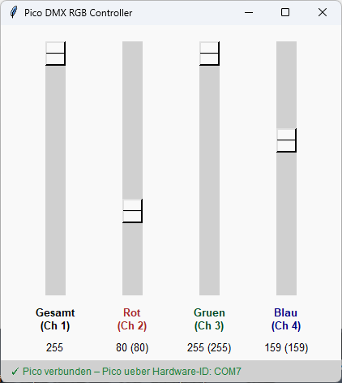

# DMXpico - two RS485 interfaces based on Raspi Pico

https://www.waveshare.com/wiki/Pico-2CH-RS485

### Firmware

* DMX-Pico2ch using Ardunio IDE

### Software

* DMXpicoCtrl.py(w) - simple DMX controller

